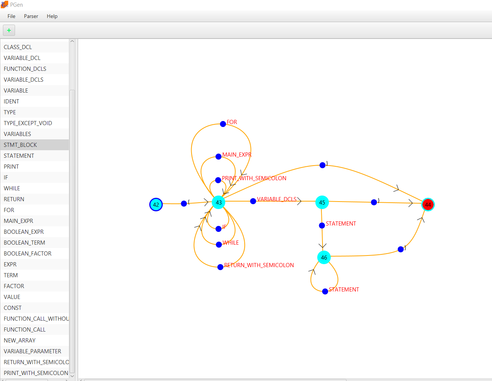
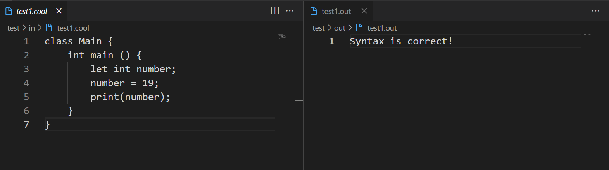

## Cool Language Parser
<hr>

This is phase #2 of complier course project at shahid beheshti university.

see [Phase 1](https://github.com/modos/cool-scanner-jflex).

to draw graphs and export parser you should use [PGen](https://github.com/Borjianamin98/PGen).

### Screenshots
<hr>




### How To Run
<hr>

1. Run PGen
```
java -jar PGen-2.2.1.jar
```

2. Create a new project and draw your graphs, then save it somewhere.

3. in the parser menu, click on 'Export Full Parser' and choose a folder so it generates  a parser based on your graphs. if graphs have issues it shows you, you must fix them first.

4. put the exported files in the parser folder in the src foler beside the CodeGen.java file.

5. Put your scanner files in the scanner folder

6. in Main.java, import parser, scanner and codeGen (codeGen here is not used but required for running project, codeGen codes developed in the next phase).

```
CompilerScanner scanner = new CompilerScanner(new FileReader(inputCoolFilePath));
CodeGen codeGen = new CodeGen();
Parser parser = new Parser(scanner, codeGen, "src/parser/table.npt");
```            

7. create your input file with .cool extension in the test/in folder

8. Run Main.java
```
java <javaClassFile> --input <inputCoolFilePath> --output <outputFilePath> --table <tablePath>
```

it creates output file in the test/out and show you the syntx in the input file is correct or wrong. you can use script_java.sh instead.


